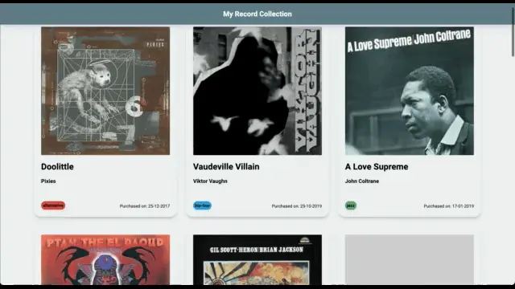

# Collectors App

Display your record collection, add new records, and share with friends!

## Description
A PHP web application for displaying a collection from a MySQL Database.

The  application features both dark and light modes, to suit the users' preferences.

## Project specification

### Story 1

**As a:** collector  
**I want:** to be able to see stored information about my collection  
**So that:** I can show off to my friends

**Requirements:**
- Items must be tied to a theme
- Each item should have at least 3 stats about it
- Database structure signed off by trainer before continuing
- Information from database must be visually displayed with the stats of each item

### Story 2

**As a:** collector  
**I want:** to be able to add new items to my collection  
**So that:** I can expand my collection

**Requirements:**
- Must be able to add a new item to the collection
- Item must be available forever

## Acknowledgements

This app was built whilst studying on the [Full Stack Track, at iO Academy](https://io-academy.uk/courses/full-stack-track/).

